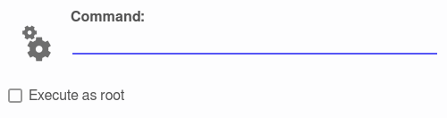

:toc:
:toc-position: preamble
:toclevels: 4
ifdef::env-github[]
:tip-caption: :bulb:
:note-caption: :information_source:
:important-caption: :heavy_exclamation_mark:
:caution-caption: :fire:
:warning-caption: :warning:
endif::[]

= DSBExec - a graphical Qt tool to execute programs

toc::[]

== About

_DSBExec_ is a graphical Qt tool to execute programs. It supports auto completion,
a command history, and allows running programs as root using
https://github.com/mrclksr/DSBSu[_DSBSu_].

== installation

=== Dependencies

* https://www.freshports.org/devel/cmake[devel/cmake]
* https://www.freshports.org/devel/qt6-base[devel/qt6-base]
* https://www.freshports.org/devel/qt6-tools/[devel/qt6-tools]

==== Getting the Source Code

[source,sh]
----
% git clone https://github.com/mrclksr/DSBExec.git
----

==== Building and Installation

[source,sh]
----
$ cd DSBExec
$ cmake -S . -B build
$ cmake --build build
----

Then as root run

[source,sh]
----
# cmake --install build
----
